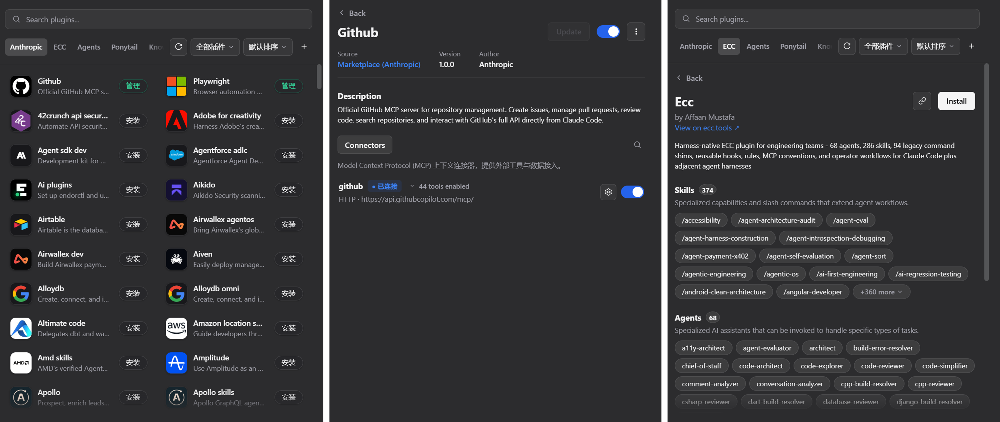

<p align="center">
  
</p>

# Universal Plugin Hub

English | [中文](README.zh.md)

[](./LICENSE)
[](https://github.com/topics/dsh-plugin)

> Plugin marketplace for [DeepSeek Harness (DSH)](https://github.com/deepseek-ai/deepseek-harness). Browse plugins from multiple Git sources, install with one click, and let their skills, subagents, MCP connectors, and LSP servers light up in DSH.


<!-- SCREENSHOT #1 (hero): replace with a full-screen shot of the browse page — search bar on top, category tabs, plugin card grid. Save as assets/hero.png -->

## What it does

Universal Plugin Hub is a visual plugin manager for DSH. It clones plugin sources (the Anthropic official catalog, community repos, or any Git repository), lists what each plugin actually provides, and wires those pieces into DSH:

- skills and slash commands become agent skills
- subagents are compiled into hub skills DSH can delegate to
- MCP connectors register into `cordis.patch.yml` as `@deepseek-ai/dsh-mcp-client` entries
- LSP servers register as `@deepseek-ai/dsh-lsp-stdio` entries — install `typescript-lsp`, restart DSH, and the `lsp` tool works
- hooks are loaded into DSH by registering a per-plugin `@deepseek-ai/dsh-hooks-claude-code` bridge entry; the bridge runs the plugin's native Claude Code `hooks.json` on DSH's own interception points

## Features

- **Multiple sources** — add or remove Git repositories as plugin sources; the built-in Anthropic catalog is always there
- **Skill & subagent scanning** — detects skills, slash commands, and subagent definitions in a plugin, and compiles subagents into hub skills
- **MCP connectors** — connectors that need no auth register automatically on install; the rest you verify and enable from the manage page
- **LSP servers** — plugins declaring `lspServers` (clangd, pyright, typescript-lsp, and more) are registered into DSH on install; the detail page shows them with an active dot
- **Hooks** — a plugin's Claude/Codex `hooks.json` is parsed and loaded into DSH via the Claude hooks bridge; the detail page shows the real events (e.g. `SessionStart`, `PreToolUse: Bash`) rather than filenames
- **Drag-to-reorder tags** — hold and drag tags to reorder, with a lifted-card visual; the order persists
- **Light / dark theme** — follows the DSH UI theme

## Requirements

- Node.js 18+
- DSH with the `web` profile (0.1.0-rc.6 or newer recommended). Plugins declaring LSP servers or Claude/Codex hooks auto-provision the matching host packages (`@deepseek-ai/dsh-lsp-stdio`, `@deepseek-ai/dsh-hooks-claude-code`, `@deepseek-ai/dsh-hook-protocol`) into the DSH installation on install — versions are picked to match the running DSH release, and DSH HMR picks up the new `cordis.patch.yml` entries within ~1s.

## Install

### From the DSH marketplace

Search **Universal Plugin Hub** in the DSH plugin market and click install.

### From the CLI

```sh
dsh plugin add universal-plugin-hub
```

### Manually

```sh
cd ~/.dsh/plugins
git clone https://github.com/CaesarEmperor/universal-plugin-hub.git
cd universal-plugin-hub
npm install
```

Restart DSH, then open the Universal Plugin Hub panel from the DSH UI.

## Quick start

1. Open the panel. The built-in **Anthropic** source is loaded by default.
2. Optional: add another source, e.g. `anthropics/claude-plugins-community`.
3. Browse or search. Open a plugin to see what it ships: skills, subagents, connectors, LSP servers.
4. Click **Install**. The hub copies the plugin, registers skills and subagents, and auto-connects what needs no setup.
5. Manage installed plugins from the manage page — enable/disable, toggle connectors, verify auth tokens, update, or remove.


<!-- SCREENSHOT #2 (install): replace with the install dialog or the manage page for an installed plugin. Save as assets/install-flow.png -->

## Project structure

```
src/       server: routes, install lifecycle, marketplace parser, git ops
client/    UI (single React file, loaded by the DSH client runtime)
scratch/   dev scripts and tests (not shipped)
```

## Development

```sh
npm install
node --check src/index.js
node --check client/client.js
node scratch/verify-lsp-support.mjs   # end-to-end check against a throwaway DSH_HOME
```

The UI is a single React file loaded through the DSH client runtime (`dsh-client-runtime` and `dsh-client-ui-theme` are injected by the host). There is no build step — edit `client/client.js` and reload.

## Support

Report bugs or request features via [GitHub Issues](https://github.com/CaesarEmperor/universal-plugin-hub/issues).

## Contributing

PRs are welcome. Keep changes surgical and run `node --check` on touched files; for server behavior changes, extend `scratch/verify-lsp-support.mjs` with end-to-end coverage.

## License

[MIT](./LICENSE) © CaesarEmperor
